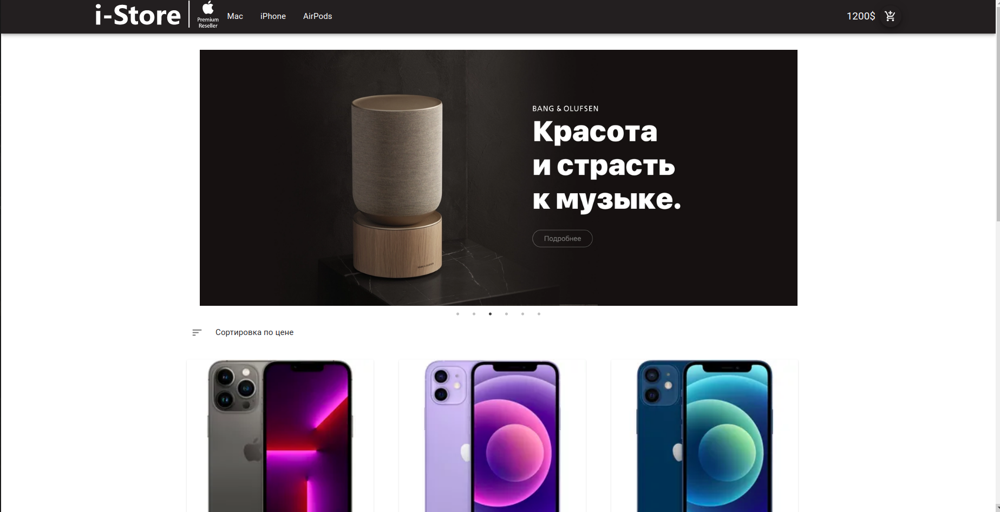
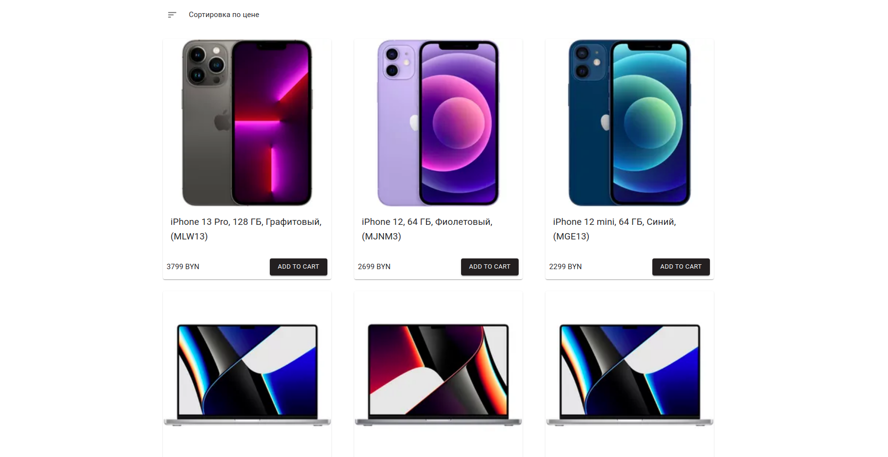
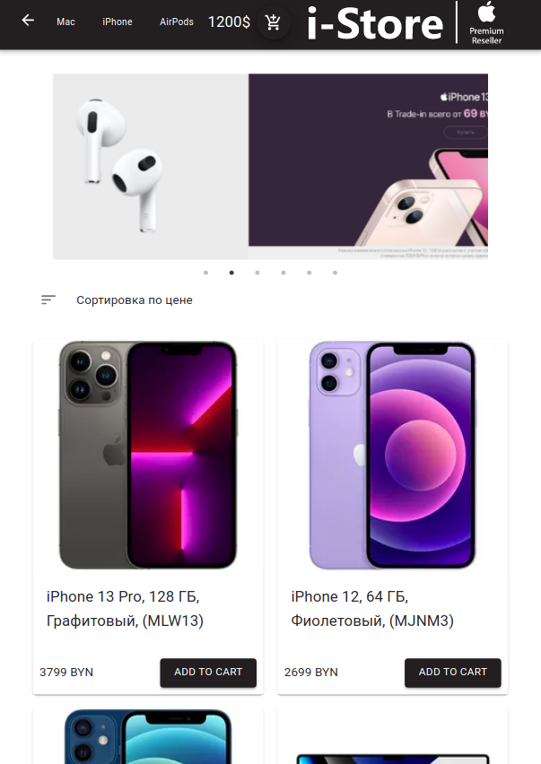

This is a [Next.js](https://nextjs.org/) project bootstrapped with [`create-next-app`](https://github.com/vercel/next.js/tree/canary/packages/create-next-app).

[Application link](https://store-ts-redux.herokuapp.com/)

```
  react
  axios
  typescript
  mode-sass
  classname
  redux
  redux-thunk
```




